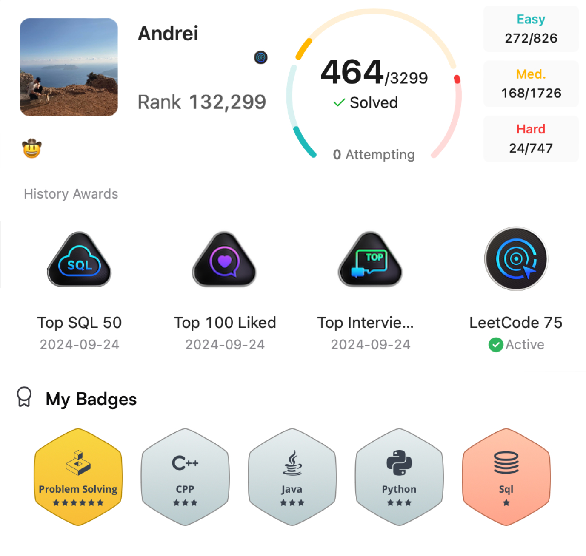

# LeetHack

Bot that solves [LeetCode](https://leetcode.com/) and [HackerRank](https://www.hackerrank.com) for you.

This bot will go through all unsolved, non-premium, non-contest tasks from a given URL. For each task it will query open ai for a solution, paste it into the code editor and press `Submit` button. Solutions are also saved into `solutions.md` with comments for further study.

> **Note**: Use at your own risk.

 [](https://www.youtube.com/watch?v=fAcbLYG7m58)

## Installation

You'll need [Node.js](https://nodejs.org/en).

```bash
npm install
```

## Configuration

Fill in your credentials in `config.json`:

```json
{
  "OPENAI_API_KEY": "",
  "MODEL": "gpt-4o",
  "MAX_TOKENS": 700,
  "URL": "https://leetcode.com/studyplan/leetcode-75/",
  "LANG": "JavaScript"
}
```

- **OPENAI_API_KEY**: ℹ️ You can obtain your API key from [OpenAI's API keys page](https://platform.openai.com/organization/api-keys). [Billing](https://platform.openai.com/settings/organization/billing/overview). [Usage dashboard](https://platform.openai.com/organization/usage). API is separate from Plus subscription.
- **MODEL**: You can specify which model to use: gpt-4, gpt-4o, gpt-4-turbo, gpt-3.5-turbo.
- **MAX_TOKENS**: Adjust this value if the solution output is being truncated.

- **LANG**: For **LeetCode** this will be set in localStorage as a lowercase string under the key 'global_lang'. For **HackerRank** the bot will attempt to select the language from a dropdown. Both Monaco and CodeMirror editors are supported.

- **URL**:
  - 📋 For **LeetCode** you can use both `/studyplan/` lists, and `/problemset/` search links, such as:
    - https://leetcode.com/studyplan/leetcode-75/
    - https://leetcode.com/studyplan/top-100-liked/
    - https://leetcode.com/studyplan/top-interview-150/
    - A filtered problemset search like https://leetcode.com/problemset/algorithms/?difficulty=EASY&status=NOT_STARTED will also work.
  - 📋 For **HackerRank** you can use both `/interview-preparation-kit/` lists, and `/domains/` search links, such as:
    - https://www.hackerrank.com/interview/interview-preparation-kit/warmup/challenges
    - https://www.hackerrank.com/interview/interview-preparation-kit/strings/challenges
    - https://www.hackerrank.com/interview/preparation-kits/one-month-preparation-kit/one-month-week-three/challenges
    - A filtered problemset search like https://www.hackerrank.com/domains/algorithms?filters%5Bstatus%5D%5B%5D=unsolved&filters%5Bdifficulty%5D%5B%5D=easy&badge_type=problem-solving will also work.

## Run

```bash
node bot.js
```

## Log In

The first time you run the bot, LeetCode / HackerRank will ask you to log in.

Log in manually, solve the CAPTCHA if needed, and press Enter in the terminal.

The bot will save your cookies (`cookies_leetcode.json` and / or `cookies_hackerrank.json` respectively), so you won’t need to log in again.

[coffee](http://ko-fi.com/intmainreturn00) ☕️
